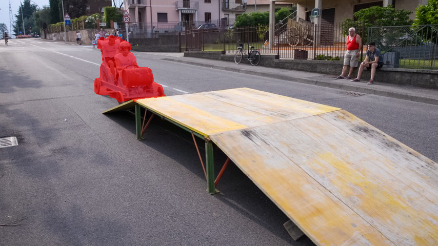
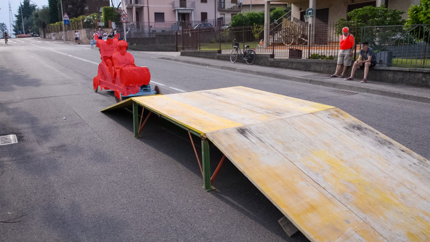
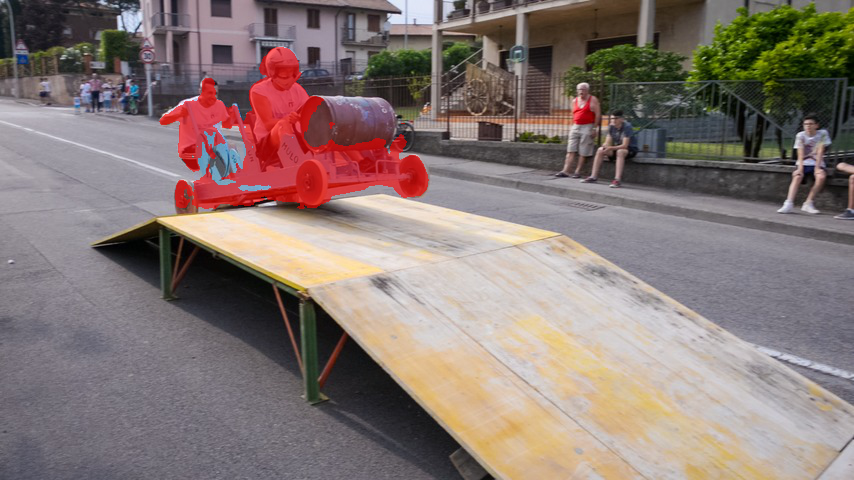
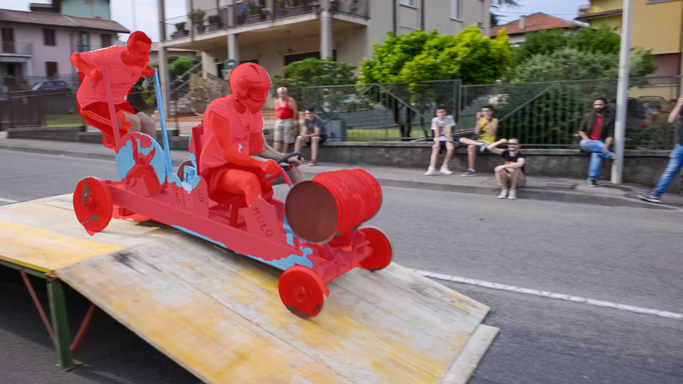
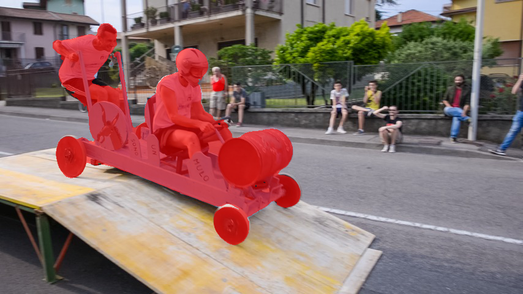
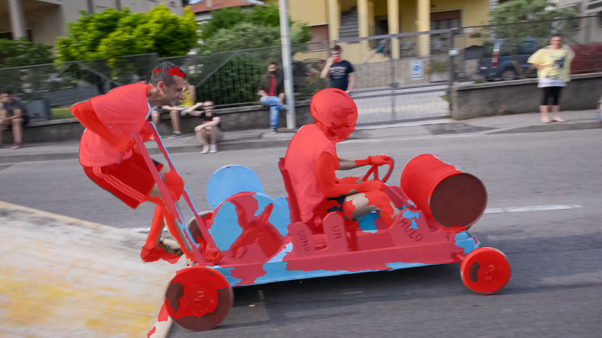
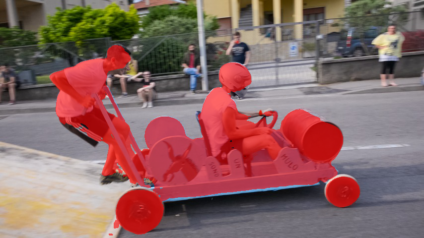
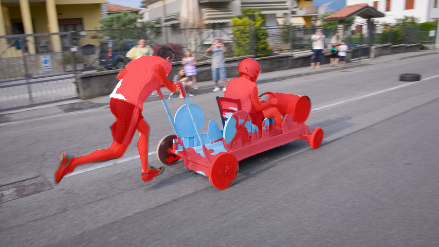
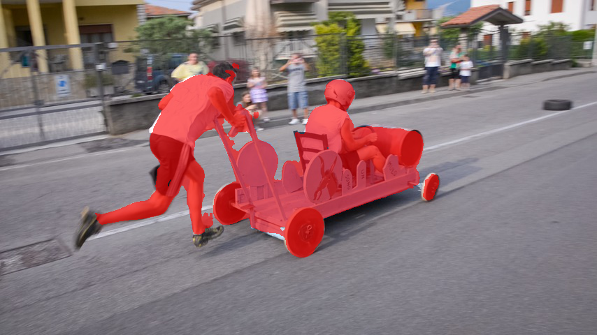

# BubbleNets
This repository is a implementation of article *Learning to Select the Guidance Frame in Video Object Segmentation by Deep Sorting Frames* by Brent Griffin.

## Change Logs

* This repository is forked from [griffbr/BubbleNets](https://github.com/griffbr/BubbleNets)

* Update to `Python3` and verified in `Tensorflow==1.13.1`

* Format code style

## Some results 

* soapbox

| frame | annotate frame 0 (OSVOS) | annotate frame 45(BubbleNets) |
|:---:|:---:|:---:|
|10|||
|30|||
|50|||
|70|||
|90|||


## Reference
[BubbleNets: Learning to Select the Guidance Frame in Video Object Segmentation by Deep Sorting Frames](http://arxiv.org/abs/1903.11779 "arXiv Paper")<br />
[Brent A. Griffin](https://www.griffb.com) and [Jason J. Corso](http://web.eecs.umich.edu/~jjcorso/)<br />
IEEE Conference on Computer Vision and Pattern Recognition (CVPR), 2019

Please cite our paper if you find it useful for your research.
```
@inproceedings{GrCoCVPR19,
  author = {Griffin, Brent A. and Corso, Jason J.},
  booktitle={2019 IEEE Conference on Computer Vision and Pattern Recognition (CVPR)},
  title = {BubbleNets: Learning to Select the Guidance Frame in Video Object Segmentation by Deep Sorting Frames},
  year = {2019}
}
```
